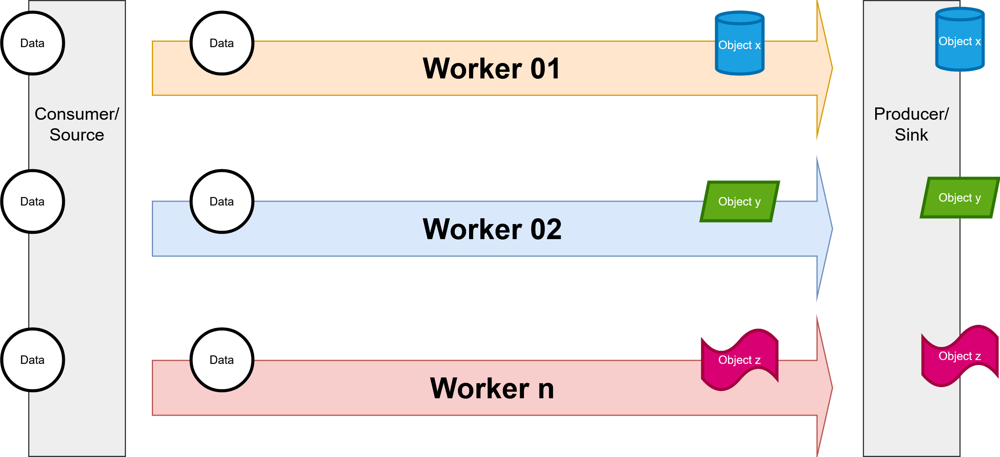

# Consumer Producer Parallelism using Goroutines



## How to build Docker Image

```sh
$ docker build -t go-parallelism .
```

## How to run Docker container from Image

```sh
$ docker run -it -v `pwd`:/app/ go-parallelism:latest bash
```

### Run program

```sh
bash-5.0# pwd
/app
bash-5.0# go run main.go
```

### Results

```txt
worker worker1 working on task 0 10:02:32
worker worker1 finish task 0
worker worker2 working on 0 10:02:32
worker worker2 finish task 0
worker worker1 working on task 1 10:02:37
worker worker1 finish task 1
worker worker2 working on 1 10:02:37
worker worker2 finish task 1
worker worker1 working on task 2 10:02:42
worker worker1 finish task 2
worker worker2 working on 2 10:02:42
worker worker2 finish task 2
worker worker1 working on task 3 10:02:47
worker worker1 finish task 3
worker worker2 working on 3 10:02:47
worker worker2 finish task 3
worker worker1 working on task 4 10:02:52
worker worker1 finish task 4
worker worker2 working on 4 10:02:52
worker worker2 finish task 4
...
...
...
```
